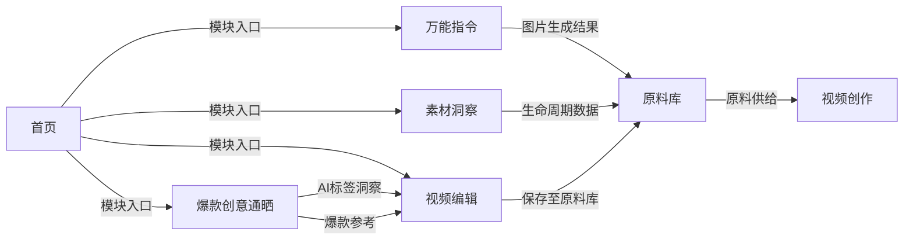

# AI 内容管理后台 · AI 化改造 PRD

> **文档版本**：v1.1  
> **更新日期**：2026-07-08  
> **承载原型**：`creative-tools-prototype.html`  
> **在线 Demo**：https://xuyan14.github.io/ai-admin-demo/  
> **关联文档**：[PRD-万能指令.md](./PRD-万能指令.md) · [PRD-仿写裂变.md](./PRD-仿写裂变.md) · [视频工具——视频编辑（批量换背景&批量换商品）.md](./视频工具——视频编辑（批量换背景&批量换商品）.md)

---

## 1. 改造背景

AI 内容管理后台（Jarvis Admin）是唯品会广告创意团队的核心运营平台，承载图片创作、视频生产、创意资产沉淀与外投素材管理。随着 AIGC 能力在 Skills Hub 的成熟，以及业务对**批量生产、智能标注、素材复用**的需求提升，本次改造目标是将 AI 能力系统化嵌入后台，形成「**生产 → 洞察 → 编辑 → 沉淀**」的闭环。

### 1.1 业务痛点

| 痛点 | 说明 |
|------|------|
| 工具分散 | 设计师在 Valet 等外部工具做单点生产，难以承接大批量外投任务 |
| 创意难复用 | 爆款素材缺乏结构化理解，编导难以快速拆解与仿写 |
| 视频镜头裂变效率低 | 实拍镜头换商品/换背景依赖人工，无法规模化 |
| 原料管理割裂 | AI 生成结果与实拍/抓取素材未统一入库，后续视频创作链路断裂 |
| 缺乏统一入口 | 新能力分散在各模块，用户难以感知本次 AI 升级全貌 |

### 1.2 改造目标

1. **默认首页宣传**：新增 AI 升级宣传首页，一屏展示核心能力与模块入口
2. **统一 AI 生产入口**：万能指令承接图片类 AIGC 生产与仿写裂变
3. **智能洞察爆款**：爆款创意通晒增加 AI 结构化标签；素材洞察支持对话式查询
4. **规模化视频编辑**：视频编辑模块支撑批量换商品/换背景异步生产
5. **原料资产沉淀**：原料库扩展 AI 来源类型，并支持多平台素材抓取入库

---

## 2. 整体架构

### 2.1 模块导航

```
首页                            ← 默认落地页，AI 升级宣传

创意工具
└── 万能指令                    ← 图片 AIGC 生产

创意资产库
├── 爆款创意通晒                ← 爆款素材浏览 + AI 标签
└── 素材洞察                    ← 对话式查询生产/消耗详情

AI 视频工具
├── 视频创作                    ← 已有（iframe 嵌入 videotool）
├── 视频编辑                    ← 新增：批量换商品 / 换背景
├── 视频库                      ← 已有（iframe 嵌入 videotool）
└── 原料库                      ← 升级：AI 来源 + 素材抓取
```

### 2.2 模块关系



| 链路 | 说明 |
|------|------|
| 首页 → 各模块 | 能力卡片与 Logo 点击直达对应功能 |
| 万能指令 → 原料库 | 图片生成结果可下载/后续对接入库（规划中） |
| 爆款通晒 → 视频编辑 | 通晒素材为编导提供爆款参考，编辑模块实现镜头裂变 |
| 素材洞察 → 各模块 | 自然语言查询素材生产链路与广告消耗（Mock） |
| 视频编辑 → 原料库 | 生产完成的视频可一键同步至原料库，供视频创作消费 |
| 原料库 → 视频创作 | 原料库作为视频创作的素材来源 |

### 2.3 布局模式

| 模块 | 布局 | 说明 |
|------|------|------|
| **首页** | 单屏全宽（左 Hero + 右能力卡片） | 无滚动，左侧宣传区 + 右侧 2×3 能力网格 |
| 万能指令 | 三栏（左表单 / 中结果 / 右任务历史） | 沿用创意工具经典布局 |
| 爆款创意通晒 | 单栏全宽 | 隐藏左侧配置面板，中间区域承载筛选 + 卡片网格 |
| 素材洞察 | 单栏全宽 AI 对话 | 左侧导航不变，主区域为对话窗口 + 底部输入框 |
| 视频编辑 | 双栏（左表单 / 右任务列表） | 对齐视频创作任务列表风格 |
| 原料库 | 单栏全宽 | 筛选区 + 工具栏 + 数据表格 |

---

## 3. 模块零：首页（AI 升级宣传）

### 3.1 模块定位

平台默认落地页，向内部用户宣传本次 AI 化改造成果，提供各核心模块的一键入口。

### 3.2 入口

- 打开平台默认进入首页（`module=home` 或不带参数）
- 左侧导航顶部「首页」
- 点击顶部 Logo 返回首页

### 3.3 页面结构（单屏无滚动）

| 区域 | 内容 |
|------|------|
| 左侧 Hero（40%） | 升级标识、主标题、简介、4 项数据指标 |
| 右侧能力区（60%） | 「全新 AI 能力」标题 + 6 张能力卡片（2×3 网格） |

### 3.4 Hero 区内容

- **标识**：2026 · AI 能力全面升级
- **主标题**：AI 驱动的创意生产新范式
- **简介**：系统性 AI 化改造，打通「生产 → 洞察 → 编辑 → 沉淀」全链路
- **数据指标**：6+ AI 能力模块 / 10× 批量生产效率 / 全链路闭环 / 对话式智能洞察

### 3.5 能力卡片

| 卡片 | 标签 | 跳转模块 |
|------|------|----------|
| 万能指令 | 核心升级 | `universalCommand` |
| 爆款创意通晒 | AI 标签 | `hotCreativeShowcase` |
| 素材洞察 | 全新 | `materialLifecycle` |
| 视频编辑 | 全新 | `videoEdit` |
| 原料库 | 升级 | `videoMaterial` |
| 视频创作 | — | `videoTool` |

点击卡片调用 `showModule()` 跳转，左侧导航栏保持可见。

### 3.6 实现状态

| 项目 | 状态 |
|------|------|
| 单屏布局 / Hero / 能力卡片 | ✅ 已实现 |
| 默认首页加载 | ✅ 已实现 |
| Logo 返回首页 | ✅ 已实现 |

---

## 4. 模块一：万能指令

> 详细功能逻辑见 [PRD-万能指令.md](./PRD-万能指令.md)；仿写裂变见 [PRD-仿写裂变.md](./PRD-仿写裂变.md)

### 3.1 模块定位

创意工具下的统一图像生成入口，支持自定义 Prompt 生图与唯品会营销素材仿写/裂变。

### 3.2 本次改造要点

#### 3.2.1 UI 升级（Arco Design 风格）

- 左侧表单采用 Arco Form 规范：纵向布局、小号尺寸、Line Tab 切换
- 表单标题「生图任务信息编辑」，中间面板标题「生成记录」
- 上传区支持点击 / 拖拽 / `Ctrl+V` 粘贴，显示 `0/10 张` 计数提示

#### 3.2.2 指令生成 Tab

| 功能 | 说明 | 状态 |
|------|------|------|
| 模型选择 | nano-banana-fast / nano-banana-pro / image-2 | ✅ 已实现 |
| 指令 Prompt | 最多 2000 字，实时字数统计 | ✅ 已实现 |
| Prompt 管理器 | 卡片库，支持新增/编辑/删除/筛选/应用，localStorage 持久化 | ✅ 已实现 |
| 背景图比例 | Auto / 1:1 / 3:4 / 9:16 / 16:9，结果区按 `aspect-ratio` 展示 | ✅ 已实现 |
| 生成数量 | 1 / 2 / 3 / 4 张，画廊网格展示 | ✅ 已实现 |
| 图片上传 | **本地读取**（`readImageLocally`），不依赖 `localhost:5001` 后端 | ✅ 已实现 |
| 图片排序 | 拖拽排序 + 左右移动 + 单张/全部删除 | ✅ 已实现 |
| 点击生产 | **Mock 生图**，不调用真实后端 API | ✅ 原型 Mock |
| 生成会话 2.0 | 统一 `generationRecord` 数据结构，支持单图/多图/九宫格分组 | ✅ 已实现 |

#### 3.2.3 仿写裂变 Tab

| 功能 | 说明 | 状态 |
|------|------|------|
| 复刻策略 | 仅仿写 / 仅裂变 / 仿写&裂变 | ✅ 已实现 |
| 素材类型 | 单品单图（101）/ 多品多图（104，9 URL 九宫格） | ✅ 已实现 |
| 参考图 URL | 单品单 URL / 多品 9 条 URL，实时预览 | ✅ 已实现 |
| 新商品 ID | 唯品会商品 ID | ✅ 已实现 |
| 生图比例 | Auto / 1:1 / 3:4 / 9:16 / 16:9 | ✅ 已实现 |
| 裂变方向 | Auto / 实拍风 / 模版化，步进器配置数量 | ✅ 已实现 |
| 裂变思路 | 选填补充指引 | ✅ 已实现 |

#### 3.2.4 生成结果交互（2.0 新增）

| 功能 | 说明 |
|------|------|
| 单图大图 / 多图网格 | 按生成数量与比例自适应布局 |
| 九宫格分组 | 多品多图仿写裂变按组展示 3×3 格子 |
| Hover 操作栏 | 每张结果图 hover 显示：**放大预览** / **下载** / **编辑** |
| 单图编辑弹窗 | 输入编辑 Prompt（≤500 字），Mock 生成并原位替换 |
| 画廊预览 | 支持左右切换浏览同批次全部结果 |
| 加载态 | 分组级 loading / 失败态 / 单格编辑中 spinner |

#### 3.2.5 任务历史

- 右侧任务列表按日期分组
- 点击卡片回填全部配置（Tab、模型、Prompt、比例、上传图等）
- 支持日期 / 任务 ID 筛选

### 3.3 数据与接口

| 项目 | 说明 |
|------|------|
| 图片上传 | 原型阶段：前端 `FileReader` 本地预览；正式：对接 `/api/upload-image` |
| 生图 API | 原型阶段：`runUniversalCommandDemo()` Mock；正式：`POST /api/change-background` |
| Prompt 库 | `localStorage` → `universalPrompts` |

---

## 5. 模块二：爆款创意通晒

### 4.1 模块定位

创意资产库下的爆款素材浏览与洞察模块，帮助编导/设计师快速发现高消耗爆款，并通过 AI 结构化标签理解素材特征，支撑后续仿写与视频裂变。

### 4.2 页面结构

| 区域 | 内容 |
|------|------|
| 筛选区 | 时间范围、投放渠道、来源、素材类型、内容类型 |
| 卡片网格 | 素材缩略图 + 元信息 + 单日消耗 |
| 分页 | 共 N 条、页码切换、20/40/60 条每页 |
| AI 标签抽屉 | 页面右侧滑出，展示结构化标签 |

### 4.3 筛选条件

| 字段 | 枚举值 |
|------|--------|
| 投放渠道 | 腾讯、字节 |
| 来源 | 代理、UED、实拍、AIGC |
| 素材类型 | 多品多图、单品单图、模板视频、实拍 |
| 内容类型 | 混剪视频、实拍、多品多图、单品单图、模板视频 |

### 4.4 素材卡片

每张卡片展示：

- 缩略图（点击可放大预览）
- 内容类型角标
- **AI 标签**按钮（`auto_awesome` 图标）
- 来源、投放渠道、素材类型、创建时间
- 单日消耗金额（¥）

### 4.5 AI 结构化标签（核心改造）

#### 4.5.1 交互设计

| 行为 | 说明 |
|------|------|
| 入口 | 卡片右上角「AI标签」按钮 |
| 展示形态 | **右侧抽屉**（非居中弹窗），宽度固定，可收起 |
| 切换素材 | 点击其他卡片 AI 标签按钮，抽屉内容平滑切换，无需关闭重开 |
| 再次点击 | 点击当前已激活卡片，收起抽屉 |
| 高亮态 | 当前激活卡片增加 `is-ai-tags-active` 边框高亮 |
| 首次加载 | 展示「AI 正在解析素材内容...」loading，约 500ms 后渲染标签 |

#### 4.5.2 标签结构

系统根据素材类型（图片 / 视频）输出不同维度：

**视频素材**

| 分组 | 字段示例 |
|------|----------|
| 内容结构 | 视频时长、剪辑节奏、叙事结构 |
| 画面特征 | 镜头类型、主要场景、人物呈现 + chips |
| 音频与转化 | 口播风格、BGM 氛围、转化钩子 |

**图片素材**

| 分组 | 字段示例 |
|------|----------|
| 商品信息 | 商品类目、价格带、品牌调性 |
| 视觉表达 | 视觉风格、构图布局、色调氛围 + chips |
| 营销卖点 | 核心卖点、适用场景、目标人群 |

#### 4.5.3 抽屉内容区

- 顶部：素材预览图 + 媒体类型徽章（图片/视频）
- 基础元信息：内容类型、素材类型、投放渠道、来源
- 下方：分组标签卡片（字段键值 + chips 标签云）

### 4.6 实现状态

| 项目 | 状态 |
|------|------|
| 筛选 / 分页 / 卡片列表 | ✅ Mock 数据（157 条） |
| AI 标签抽屉 UI | ✅ 已实现 |
| AI 标签内容 | ✅ Mock 规则生成（`buildHcsAiTags`） |
| 真实 AI 解析 API | ⏳ 待对接 |

---

## 6. 模块三：素材洞察

### 6.1 模块定位

创意资产库下的 AI 对话查询模块，用户通过自然语言 Prompt 获取素材的**生产详情**与**广告消耗详情**，支持多轮追问与思考过程展示。

### 6.2 入口

- 导航：**创意资产库 → 素材洞察**
- 首页能力卡片直达

### 6.3 页面结构

| 区域 | 内容 |
|------|------|
| 顶部栏 | 模块标题 +「AI 助手 · Mock」标识 |
| 对话区 | 欢迎页（推荐问题）/ 多轮消息列表 |
| 底部输入 | 文本框 + 发送按钮；Enter 发送，Shift+Enter 换行 |

### 6.4 对话交互

#### 6.4.1 用户消息

- 右对齐蓝色气泡展示用户输入

#### 6.4.2 AI 回复

每条 AI 回复包含两部分：

| 部分 | 说明 |
|------|------|
| **思考过程** | 可展开/收起的 4 步推理链：理解意图 → 检索生产链路 → 查询投放数据 → 汇总报告；生成时逐步动画展示 |
| **结构化答复** | 生产详情表 + 广告消耗表（或列表/对比视图） |

#### 6.4.3 推荐问题（欢迎页）

- 查询素材 87801 的生产详情和近7日广告消耗
- 商品 ID 最近投放了哪些素材？
- 分析实拍混剪视频的完整生命周期
- 对比素材在不同渠道的消耗表现

### 6.5 Mock 智能识别

根据用户输入关键词返回不同 Mock 结果：

| 意图 | 触发关键词 | 返回内容 |
|------|-----------|----------|
| 单素材详情 | 素材 ID、生产详情 | 生产详情表 + 近 N 日消耗明细 |
| 商品素材列表 | 哪些、投放了 | 商品下素材列表 + 合计消耗 |
| 渠道对比 | 对比、渠道 | 各渠道曝光/点击/消耗/ROI 对比表 |

### 6.6 实现状态

| 项目 | 状态 |
|------|------|
| 对话 UI / 思考过程 / 多轮对话 | ✅ 已实现 |
| 结构化表格 Mock 答复 | ✅ 已实现 |
| 真实 LLM + 数据 API 对接 | ⏳ 待对接 |

---

## 7. 模块四：视频编辑

> 业务背景与 Skill 定义见 [视频工具——视频编辑（批量换背景&批量换商品）.md](./视频工具——视频编辑（批量换背景&批量换商品）.md)

### 5.1 模块定位

AI 视频工具下的批量视频编辑入口，支撑实拍镜头规模化裂变：**换商品**（保留场景换主体）与**换背景**（保留商品与动作换场景）。

### 5.2 入口与布局

- 导航：**AI 视频工具 → 视频编辑**（位于视频创作之后）
- 布局：左侧任务表单（420px）+ 右侧任务列表（对齐视频创作任务列表 Arco Card 风格）

### 5.3 换商品

| 功能 | 规则 |
|------|------|
| 上传视频 | 点击/拖拽上传 MP4、MOV；支持粘贴 URL 解析；展示已上传列表，可删除 |
| 商品 ID | 必填，支持逗号/分号批量分隔 |
| 任务数计算 | **视频数 × 商品 ID 数** |
| 提交校验 | 至少 1 个视频 + 至少 1 个商品 ID |

**关联 Skill**：`vip-ad-creative@vip-product-video-pipeline`

### 5.4 换背景

| 功能 | 规则 |
|------|------|
| 背景模式 | **Auto / 人工** 切换开关，默认 **Auto** |
| Auto 模式 | 系统基于视频内容智能匹配背景，**无需填写描述**；任务数 = 视频数 |
| 人工模式 | 显示背景描述文本框 + 预设词快捷按钮；描述必填；任务数 = 视频数 |
| 预设背景词 | 阳光房、温馨书房、海滩背景、公园户外 |
| 提交提示 | 视频时长 ≤ 15 秒；建议不含人脸 |

**关联 Skill**：`vip-ad-creative@video-imitate-background`（基于 Seedance 2.0，商品/动作/景别 100% 保留，背景微调 10–30%）

### 5.5 任务列表

#### 5.5.1 批次展示

- 每次提交形成一个批次卡片（`.ve-drawer-task-item`）
- 头部：任务标题（可点击回填左侧表单）、提交时间
- 中部：横向滚动的素材卡片列表
- 底部：生产中显示总进度条；任务提交时间元信息

#### 5.5.2 素材卡片

对齐视频创作 `task-video-card` 样式：

| 元素 | 说明 |
|------|------|
| 状态标签 | 任务成功 / 生产中（带图标） |
| 封面 | 150×150 居中展示 |
| 标题 | 结果标签（如「商品6921298…·视频1」） |
| 元信息 | 时长、文件大小 |
| 生产中 | 封面半透明 + mini 进度条 + 百分比 |
| 已完成 Hover | 蒙层显示三个 icon：**保存** / **下载** / **浏览** |

#### 5.5.3 卡片操作

| 操作 | 行为 |
|------|------|
| 保存 | 打开「保存至原料库」弹窗（预选当前视频） |
| 下载 | 直接触发单视频下载 |
| 浏览 | 打开任务查看弹窗，定位到该视频 |

#### 5.5.4 查看弹窗

- 主预览区 + 底部缩略图条
- 缩略图支持勾选（多选/单选）
- 底部按钮：**取消** / **下载** / **保存至原料库**

#### 5.5.5 保存至原料库弹窗

| 字段 | 规则 |
|------|------|
| 是否默认启用 | 单选：是（默认）/ 否 |
| 编导 | 单选网格：范家荣、陆舒茵、黄健翻、胡俊AI、李焕荣AI、李慧丹AI、宁翠莲AI、欧靖丹AI、谢筱妍AI、其他 |
| 其他编导 | 选择「其他」时显示文本输入框 |
| 确认 | Toast 提示同步成功（含启用状态与编导信息） |

### 5.6 任务回填

点击任务标题，将以下信息回填至左侧表单：

- 任务类型（换商品 / 换背景）
- 源视频列表
- 商品 ID / 背景描述
- 背景模式（`bgMode: auto | manual`）

### 5.7 实现状态

| 项目 | 状态 |
|------|------|
| 表单 UI / 校验 / 任务数计算 | ✅ 已实现 |
| 任务列表 / 卡片 Hover / 弹窗 | ✅ 已实现 |
| 进度模拟 | ✅ Mock（`simulateVeTaskProgress`） |
| Skill API 对接 | ⏳ 待对接 |
| 保存至原料库后端写入 | ⏳ 待对接（当前 Toast Mock） |

---

## 8. 模块五：原料库

### 6.1 模块定位

AI 视频工具下的视频原料资产管理中心，统一承载人工实拍、AI 生成、代理素材及外部抓取物料，为视频创作提供原料供给。

### 6.2 页面结构

| 区域 | 内容 |
|------|------|
| 筛选区 | 多维度组合筛选（两行表单项） |
| 工具栏 | 上传素材、素材抓取、导出素材 |
| 数据表格 | 17 列全量信息展示 |
| 分页 | 共 N 条，20/50/100 条每页 |

### 6.3 筛选条件

| 字段 | 说明 |
|------|------|
| 品牌名称 / 商品ID / 商品名称 / 素材名称 | 文本模糊匹配 |
| 素材状态 | 启用 / 屏蔽 / 草稿 |
| 素材类型 | 自运营实拍 / 代理素材 / 混剪AI视频 / 物料抓取 |
| 来源类型 | 人工实拍 / AI镜头 / AI爆款复刻 / 物料抓取 |
| 编导 | 下拉选择 |
| 上传时间 | 日期范围 |
| 上传OA | 文本匹配 |

**默认筛选**：启用 + 自运营实拍

### 6.4 表格字段

| 列 | 说明 |
|----|------|
| 视频封面 | 点击预览 |
| 素材源ID | 唯一标识 |
| 素材类型 | 物料抓取类型带特殊标签样式 |
| 来源类型 | AI 相关来源区分展示 |
| 编导 | 负责人 |
| 视频画面标签 | 商品展示 / 细节特写 / 穿搭场景 / 功能演示 |
| 品牌名称 / 商品ID / 商品名称 | 商品关联信息 |
| 素材批次 / 素材名称 | 批次管理 |
| 素材状态 | 启用 / 屏蔽 / 草稿（色标） |
| 文件类型 | mp4 等 |
| 上传时间 / 更新时间 / 上传OA | 审计信息 |
| 操作 | 编辑 / 启用 / 屏蔽 |

### 6.5 素材抓取（核心改造）

#### 6.5.1 入口

工具栏「素材抓取」按钮，打开抓取弹窗。

#### 6.5.2 抓取配置

| 字段 | 规则 |
|------|------|
| 商品 ID | 必填，支持从列表筛选区预填 |
| 抓取模式 | **Auto 模式**（默认）/ **指定链接** |
| Auto 模式 | 智能匹配，自动从抖音、B站、小红书、淘宝全平台抓取 |
| 指定链接 | 分别为四个平台填写视频/商品链接，至少填 1 个 |

#### 6.5.3 任务管理

- 弹窗内展示抓取任务列表
- 任务状态：排队中 → 查询商品 → 抓取中 → 已完成 / 部分成功 / 失败
- 每任务展示：商品ID、商品名称、进度条、状态消息、平台步骤
- 同商品 ID 不允许重复提交进行中任务

#### 6.5.4 入库规则（规划）

抓取成功的视频以「物料抓取」素材类型、「物料抓取」来源类型写入原料库。

### 6.6 与视频编辑联动

视频编辑模块「保存至原料库」写入的素材预期字段：

| 字段 | 取值 |
|------|------|
| 素材类型 | 混剪AI视频 |
| 来源类型 | AI镜头 |
| 素材状态 | 按弹窗「是否默认启用」 |
| 编导 | 按弹窗选择 |

### 6.7 实现状态

| 项目 | 状态 |
|------|------|
| 筛选 / 表格 / 分页 | ✅ Mock 数据（1312 条） |
| 启用 / 屏蔽操作 | ✅ 前端 Mock |
| 素材抓取弹窗 + 任务进度 | ✅ Mock 模拟 |
| 上传素材 / 导出 | ⏳ Toast 占位 |
| 后端 API / 真实入库 | ⏳ 待对接 |

---

## 9. 跨模块能力矩阵

| 能力 | 首页 | 万能指令 | 爆款通晒 | 素材洞察 | 视频编辑 | 原料库 |
|------|:----:|:--------:|:--------:|:--------:|:--------:|:------:|
| 宣传入口 | ✅ | — | — | — | — | — |
| AI 生产 | — | ✅ | — | — | ✅ | — |
| AI 洞察/标签 | — | — | ✅ | ✅ | — | — |
| 对话式查询 | — | — | — | ✅ | — | — |
| 批量异步任务 | — | ✅ | — | — | ✅ | ✅（抓取） |
| 结果预览 | — | ✅ | ✅ | — | ✅ | ✅ |
| 下载 | — | ✅ | — | — | ✅ | ⏳ |
| 入库沉淀 | — | ⏳ | — | — | ✅ | ✅ |
| Mock 原型 | ✅ | ✅ | ✅ | ✅ | ✅ | ✅ |

---

## 10. 技术实现说明

### 8.1 原型文件

所有改造集中实现在 `creative-tools-prototype.html` 单文件中，包含 HTML 结构、CSS 样式、JavaScript 逻辑及模态框/抽屉 DOM。

### 8.2 关键标识符

| 模块 | 初始化函数 | 根容器 ID | 状态对象 |
|------|-----------|-----------|----------|
| 首页 | `initHomePage` | `homePageRoot` | — |
| 万能指令 | `submitUniversalCommand` | — | `universalUploadedImages` / `currentUniversalGenerationSession` |
| 爆款通晒 | `initHotCreativeShowcase` | `hotCreativeShowcaseRoot` | `hotCreativeAllItems` |
| 素材洞察 | `initMaterialLifecycle` | `materialLifecycleRoot` | `mlcState` |
| 视频编辑 | `initVideoEdit` | `videoEditFormRoot` / `videoEditTaskRoot` | `veState` |
| 原料库 | `initMaterialLibrary` | `materialLibraryRoot` | `materialLibAllItems` / `mlCrawlTasks` |

### 8.3 Mock 与正式环境差异

| 功能 | 原型行为 | 正式预期 |
|------|----------|----------|
| 万能指令上传 | `readImageLocally` 本地 Blob URL | COS 上传 + 永久 URL |
| 万能指令生图 | `runUniversalCommandDemo` 延时 Mock | NanoBanana API + 轮询 |
| 万能指令编辑 | 延时替换 Demo 图 | 调用编辑 API |
| 爆款 AI 标签 | `buildHcsAiTags` 规则生成 | 多模态理解 API |
| 素材洞察答复 | `buildMlcMockResponseHtml` 规则生成 | LLM + 数据查询 API |
| 视频编辑生产 | `simulateVeTaskProgress` | Skill 异步队列 |
| 视频编辑入库 | Toast 提示 | 原料库写入 API |
| 原料库数据 | `buildMaterialLibDataset` 前端生成 | 后端分页查询 |
| 素材抓取 | `runMlCrawlTask` 前端模拟 | 爬虫服务 + 任务队列 |

---

## 11. 非功能需求

| 类别 | 要求 |
|------|------|
| 浏览器 | Chrome / Safari / Edge 近期版本 |
| 响应式 | 原料库筛选区在 ≤1400px 时列数自适应 |
| 性能 | 列表分页加载，图片 `loading="lazy"` |
| 一致性 | 视频编辑任务列表对齐 videotool 任务卡片规范 |
| 可访问性 | AI 标签抽屉支持收起；表单必填项标红星 |

---

## 12. 后续规划

### P0 · 后端对接

- [ ] 万能指令：恢复 `/api/upload-image` + `/api/change-background` 真实调用
- [ ] 视频编辑：对接 `vip-product-video-pipeline` / `video-imitate-background` Skill
- [ ] 视频编辑 → 原料库：打通保存入库 API
- [ ] 原料库：分页查询、上传、导出真实接口

### P1 · AI 能力增强

- [ ] 爆款通晒：对接真实多模态 AI 标签解析服务
- [ ] 原料库素材抓取：对接爬虫任务服务，抓取结果自动入库
- [ ] 万能指令生成结果：支持直接保存至原料库（图片类）

- [ ] 素材洞察：对接真实 LLM 与素材/投放数据 API

### P2 · 体验优化

- [ ] 视频编辑：支持生产中取消任务
- [ ] 爆款通晒：AI 标签支持一键「仿写裂变」跳转万能指令
- [ ] 原料库：批量操作（批量启用/屏蔽/导出）
- [ ] 全模块：统一任务中心，跨模块查看生产进度

---

## 13. 附录

### 13.1 在线 Demo 地址

| 环境 | URL |
|------|-----|
| GitHub Pages（推荐） | https://xuyan14.github.io/ai-admin-demo/ |
| 统一原型入口 | https://xuyan14.github.io/ai-admin-demo/creative-tools-prototype.html |
| 本地预览 | `http://localhost:8877/creative-tools-prototype.html` |

模块直达参数示例：

- `?module=home`（默认）
- `?module=universalCommand`
- `?module=hotCreativeShowcase`
- `?module=materialLifecycle`
- `?module=videoEdit`
- `?module=videoMaterial`

### 13.2 GitHub Pages 部署说明

- **分支**：`gh-pages`
- **Workflow**：`.github/workflows/deploy.yml`（push 到 `gh-pages` 自动部署）
- **入口**：根目录 `index.html` → `creative-tools-prototype.html`
- **限制**：纯静态 Demo；万能指令生图、素材洞察、视频编辑生产等为前端 Mock，不依赖本地后端

### 13.3 关联 Skill

| Skill | 用途 |
|-------|------|
| `vip-ad-creative@vip-product-video-pipeline` | 批量换商品 |
| `vip-ad-creative@video-imitate-background` | 批量换背景 |

### 13.4 文档修订记录

| 版本 | 日期 | 说明 |
|------|------|------|
| v1.1 | 2026-07-08 | 新增首页、素材洞察模块；更新导航与 GitHub Pages 部署说明 |
| v1.0 | 2026-07-07 | 初版：梳理万能指令、爆款通晒、视频编辑、原料库 AI 化改造 |
